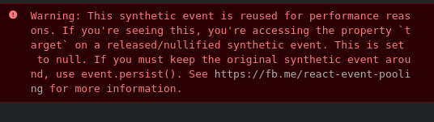
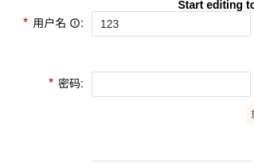
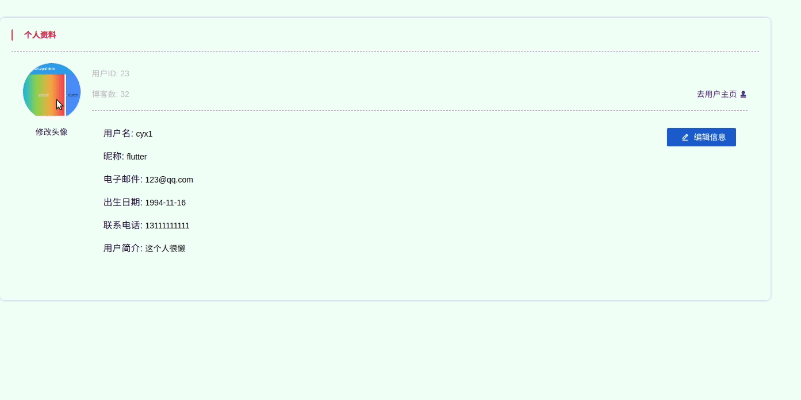

# React+Koa+Mysql 实现个人博客功能

### 写在前面

菜鸟用来练手的小项目，各位大佬如果有看不下去的代码记得指点一下啊谢谢

不定时更新

### 技术栈

#### 1. 后端 Koa+Mysql

- 所用中间件
  - koa-static
  - ioredis
  - koa-session2
  - koa2-cors
  - koa-router
  - koa-jwt

#### 前端使用框架 React+Hooks+Typescript

- 组件库: Zent

#### 开发进度

| 功能         | 功能列表                                                     | 完成情况 |
| ------------ | ------------------------------------------------------------ | -------- |
| 代办事项     | 1. 代办事项添加<br />2. 代办事项修改<br />3. 代办事项删除<br />4. 代办事项完成<br />5. 代办事项拖动完成，拖动撤回(拖动React组件完成) | 全部完成 |
| 博客首页     | 1. 博客列表查询<br />2. 博客列表的滑动下拉加载<br />3. 博客首页代办事项提醒<br />4. 博客首页头部信息<br />5.博客浏览量和评论数查询 | 完成     |
| 文件中心     | 1. 文件的上传<br />2. 文件的下载<br />3. 文件列表的查询      | 完成     |
| 博客         | 1. 添加博文标签<br />2. 博文副文本编辑<br />3. 博客的修改<br />4. 博客评论系统完成<br />5. 博文的模糊查询功能<br />6. 博文的删除功能 | 完成     |
| 个人博客中心 | 1. 个人博客分页查询<br />2. 个人博客的编辑查看               | 完成     |
| 用户登陆     | /                                                            | 完成     |
| 用户注册     | /                                                            | 完成     |
| 用户中心     | 1. 用户头像的修改<br>2. 用户详细信息的展示<br>3. 用户详细信息的修改功能 | 完成     |


##### **即将更新**

1. 进入用户个人博客主页

......

## 下面为开发过程中碰到的问题小结

### 踩坑指南

#### 1. useReducer 的 initialState 无法被赋值给 type never

```javascript
const reducer = (state: IUserState, action: UserAction) => {
  switch (action.type) {
    case 'login':
      return { ...state, ...action.payload };

    case 'logout':
      return { ...state, ...initUserInfo };

    default:
      return;
  }
};

export const UserProvider: React.FC<{}> = props => {
  const { children } = props;

  // typescript 报错　Argument of type '{ username: string; userId: string; isLogin: boolean; }' is not assignable to parameter of type 'never'.ts(2345)
  const [state, dispatch] = useReducer(reducer, initUserInfo);

  return (
    <>
      <UserContext.Provider value={{ state, dispatch }}>
        {children}
      </UserContext.Provider>
    </>
  );
};
```

**解决方案：**

在 reducer 的 default 的返回应该为 state，而不是返回一个 undefined

#### 2. koa2 使用 jwt 完成用户登录持久化

##### 1. 方案

1. 登录完毕后，后端返回加密的 token(利用 jsonwebtoken 进行加密)
2. 需要鉴权的接口，在请求的时候在 request header 中添加 Authorization
3. 后端根据解析 header Authorization 并进行鉴权
4. 鉴权成功返回数据

#### 2. 所用到的库

- koa2-cors
- koa-jwt
- jsonwebtoken

#### 3. 容易出现问题的原因

- cors 和　 jwt 中间件的使用顺序，先使用 cors 再使用 jwt

```javascript
app.use(
  cors({
    origin: ctx => 'http://localhost:3000',
    maxAge: 1000,
    credentials: true,
    allowHeaders: ['Content-Type', 'Authorization', 'Accept'],
    exposeHeaders: ['WWW-Authenticate', 'Server-Authorization', 'Set-Cookie']
  })
);

app.use((ctx, next) => {
  return next().catch(err => {
    if (err.status === 401) {
      ctx.status = 401;
      ctx.body = 'User Verify failed';
    } else {
      throw err;
    }
  });
});

app.use(
  koajwt({
    secret: 'my_token'
  }).unless({
    path: [/\/api\/user\/.*/]
  })
);
```

> Notes: 如果先设置 koa-jwt 接口直接因为跨域的问题，无法进到 koa-jwt 的鉴权中

- 前端在请求头添加 token 的方法(利用 Axios 拦截器)

```javascript
Axios.interceptors.request.use(config => {
  const token = window.localStorage.getItem('userToken');
  if (token) {
    config.headers['Authorization'] = 'Bearer ' + token;
  }
  return config;
});
```

- 前端通过拦截器捕获 token 过期不存在的异常情况

```javascript
Axios.interceptors.response.use(
  res => {
    return res;
  },
  error => {
    if (error.response.status === 401) {
      window.location.href = 'http://localhost:3000/#/login';
    }

    return error;
  }
);
```

- 前端获取登录 token 并保存

```javascript
const handleLogin = async () => {
  // 获取表单数据
  const { username, password } = form.getValue();
  const { data } = await userLogin(username, password);
  const { token } = data;
  window.localStorage.setItem('userToken', token);
  history.push('/home');
};
```

#### 4. margin: auto 失效的解决办法

- 元素的 display 设为 block

#### 5. javascript Blob 与字符串之间的转换

使用 iconv-lite 库中的 decode 方法

```javascript
const iconv = require('iconv-lite');
// 这里的todoItem是一个blob对象 type: text
elem.todoItem = iconv.decode(elem.todoItem, 'UTF-8');
```

#### 6. mysql 插入 datetime 数据类型格式不对的解决办法

```javascript
// 这里的startTime是前端传过来经过Date.IOString转化的字符串
// 先通过new Date转换为JS的Date对象
// 之后通过moment库转换数据格式
const _startTime = moment(new Date(startTime)).format('YYYY-MM-DD HH:mm:ss');
const _endTime = moment(new Date(endTime)).format('YYYY-MM-DD HH:mm:ss');
```

#### 7. 在 canvas 中添加外部字体写 text 的方法

```javascript
// 这里创建一个link导入本地的@font-face
const link = document.createElement('link') as HTMLLinkElement;
link.rel = "stylesheet";
link.type = "text/css";
link.href = "../../static/style/mixins.css";

document.getElementsByTagName('head')[0].appendChild(link);

var image = new Image;
image.src = link.href;
image.onerror = function() {
  ctx.font = "100px betty";
  ctx.textAlign = "center";
  ctx.strokeText('Blog', 0, 0);
}
```

// css 这里导入一个@font-face

```css
@font-face {
  font-family: betty;
  src: url('../font/bellada\ personal\ license.ttf');
}

.header {
  font-family: 'betty';
}
```

上面的步骤操作完可能还没有能拿到字体，简单粗暴的解决办法

```html
<div className="header">
  <canvas width="600" height="300" id="plot"></canvas>
</div>
```

这样即可导入外部字体

#### 8. 优雅的处理 async/await 中的异常

```javascript
// 模拟一个Promise的事件

const getRandom = () =>
  new Promise((resolve, reject) => {
    const num = Math.random() * 5;
    if (num < 0.5) {
      resolve({ status: true, data: num });
    } else {
      reject({ status: false });
    }
  });

const to = promise =>
  promise
    .then(data => {
      console.log('success', data);
      return [null, data];
    })
    .catch(err => {
      console.log('faild', err);
      return [err];
    });

async function catchError() {
  const [err, data] = await to(getRandom());
  // 只需要判断err是否为null即可判断该异步程序执行是否有报错
  console.log(err, data);
}

catchError();
```

#### 9. React Hooks 中 useRef, useImperativeHandle, forwardRef 的使用方法

##### 1. 三者用处

1. useRef: 用于获取元素的原生 DOM 或者获取自定义组件所暴露出来的 ref 方法(父组件可以通过 ref 获取子组件，并调用相对应子组件中的方法)
2. useImperativeHandle:在函数式组件中，用于定义暴露给父组件的 ref 方法。
3. React.forwardRef: 将 ref 父类的 ref 作为参数传入函数式组件中，本身 props 只带有 children 这个参数，这样可以让子类转发父类的 ref,当父类把 ref 挂在到子组件上时，子组件外部通过 forwrardRef 包裹，可以直接将父组件创建的 ref 挂在到子组件的某个 dom 元素上

##### 2. 一个 React.forwardRef 的例子

```javascript
function InputWithLabel(props) {
  // 这里的myRef为通过外部打入的父级ref节点
  const { label, myRef } = props;
  const [value, setValue] = useState('');
  const handleChange = e => {
    const value = e.target.value;
    setValue(value);
  };

  return (
    <div>
      <span>{label}:</span>
      <input type="text" ref={myRef} value={value} onChange={handleChange} />
    </div>
  );
}

// 这里用forwardRef来承接得到父级传入的ref节点，并将其以参数的形式传给字节点
const RefInput = React.forwardRef((props, ref) => (
  <InputWithLabel {...props} myRef={ref} />
));

// 调用该RefInput的过程
function App() {
  // 通过useRef hook 获得相应的ref节点
  const myRef = useRef(null);

  const handleFocus = () => {
    const node = myRef.current;
    node.focus();
  };

  return (
    <div className="App">
      <RefInput label={'姓名'} ref={myRef} />
      <button onClick={handleFocus}>focus</button>
    </div>
  );
}
```

**结果**


结果分析：<font color=red>**通过 focus 直接子元素中 input 的 DOM 节点**</font>

##### 3. 存在问题

这样我们的 Ref 获得的是整个节点，但是有时候我们通过 ref 只需要暴露一部分参数就行了，为了解决这个问题，我们就需要用到 useImperativeHandle 来指定放出一部分我们需要的方法或者属性给父级

##### 4. 使用 forwardRef 和 useImperativeHandle 的方案

- 思路：
  - 子组件内部自建一个\_innerRef 来获取 ref 元素
  - 将通过 forwarfRef 传入的 ref 元素通过 useImperativeHandle 来进行绑定，指定该子组件对外暴露的方法或属性
  - 通过\_innerRef 调用响应的方法然后同时在 useImperativeHandle 中写代码即可，这样可以只暴露一部分方法属性，而不是整个底层的 input 原生 DOM 节点

```javascript
function InputWithLabel(props) {
  const { label, myRef } = props;
  const [value, setValue] = useState('');
  const _innerRef = useRef(null);
  const handleChange = e => {
    const value = e.target.value;
    setValue(value);
  };

  const getValue = () => {
    return value;
  };

  useImperativeHandle(myRef, () => ({
    getValue,
    focus() {
      const node = _innerRef.current;
      node.focus();
    }
  }));

  return (
    <div>
      <span>{label}:</span>
      <input
        type="text"
        ref={_innerRef}
        value={value}
        onChange={handleChange}
      />
    </div>
  );
}
```

##### 5. 结果


结果分析：<font color=red>**通过 focus 只能获取我们指定向外暴露那部分的方法**</font>

##### 6. 完整代码

```javascript
import React, { useRef, useState, useImperativeHandle } from 'react';
import ReactDOM from 'react-dom';

import './styles.css';

function InputWithLabel(props) {
  const { label, myRef } = props;
  const [value, setValue] = useState('');
  const _innerRef = useRef(null);
  const handleChange = e => {
    const value = e.target.value;
    setValue(value);
  };

  const getValue = () => {
    return value;
  };

  useImperativeHandle(myRef, () => ({
    getValue,
    focus() {
      const node = _innerRef.current;
      node.focus();
    }
  }));

  return (
    <div>
      <span>{label}:</span>
      <input
        type="text"
        ref={_innerRef}
        value={value}
        onChange={handleChange}
      />
    </div>
  );
}

const RefInput = React.forwardRef((props, ref) => (
  <InputWithLabel {...props} myRef={ref} />
));

function App() {
  const myRef = useRef(null);

  const handleFocus = () => {
    const node = myRef.current;
    (node);
    node.focus();
  };

  return (
    <div className="App">
      <RefInput label={'姓名'} ref={myRef} />
      <button onClick={handleFocus}>focus</button>
    </div>
  );
}

const rootElement = document.getElementById('root');
ReactDOM.render(<App />, rootElement);
```

#### 10 . React 图片或者文件上传问题

- 通过 base64 前端处理图片为 base64 的解决方案
  - 利用 FileReader 对数据进行读取，如果是图片会将图片读取为 base64 的形式
  - 将得到的 base64 的字符串传给后端
  - 后端直接保存该html字符串，之后调用接口查询该数据直接前端通过img标签完成自动解析即可

[参考博文](https://blog.csdn.net/dreamer2020/article/details/51794450)

- 代码实现

```javascript
function App() {
  const handleFileChange = e => {
    const file = e.currentTarget.files[0];
    const reader = new FileReader();

    reader.onload = function() {
      // reader.results当完成onload后会将图片转为base64
      // 后端只要解析base64对应的字符串即可
      const result = this.result;
      console.log(result);
    };

    reader.readAsDataURL(file); // 得到经过base64编码的图片信息
  };

  return (
    <div className="App">
      <input type="file" onChange={handleFileChange} />
    </div>
  );
}
```

+ 利用input,xhr,formData来实现
  + 利用input[type='file']来实现
  + 点击选择文件，且选择文件完毕后，触发onChange事件
  + 通过event.targer.files(react中)获取所选文件
  + 通过FormData这个类，将文件添加到其实例中
  + 配置xhr，通过POST的方式发送formData到后端即可

~~~javascript
import React, { useState } from 'react';
import { ApiHost } from '../../constant';
import { Button, FormControl, Progress } from 'zent';

export type UploadCompletCallback<T> = (
  e: ProgressEvent<XMLHttpRequestEventTarget>,
  reponse: T
) => void;

export type UploadStartCallback = (
  e: ProgressEvent<XMLHttpRequestEventTarget>
) => void;

export type UploadProcessCallback = (loaded: number, total: number) => void;

interface Props {
  onComplete?: UploadCompletCallback<any>;
  onStart?: UploadStartCallback;
  onProcess?: UploadProcessCallback;
  hasProcess?: boolean;
  title: string;
}

export const UploadBtn: React.FC<Props> = props => {
  const { onComplete, onStart, onProcess, hasProcess = false, title } = props;
  const [progress, setProgress] = useState<number>(0);
  const [uploadStatus, setStatus] = useState<boolean>(false);

  // 处理文件上传的核心方法
  const handleChange = (e: React.ChangeEvent<HTMLInputElement>) => {
    const files = e.target.files;

    if (files) {
      if (!files.length) return;

      // 将文件处理成formData
      let formData = new FormData();
      for (let k in files) {
        formData.append('file', files[k], window.encodeURI(files[k].name));
      }

      let xhr = new XMLHttpRequest();

      xhr.responseType = 'json';
      xhr.timeout = 5000;
      xhr.open('POST', `${ApiHost}/user/upload`, true);

      // 事件监听
      xhr.addEventListener('loadstart', e => {
        setProgress(0);
        setStatus(true);
        onStart && onStart(e);
      });

      xhr.upload.onprogress = function(e) {
        const { total, loaded } = e;
        setProgress((loaded / total) * 100);
        onProcess && onProcess(loaded, total);
      };

      xhr.addEventListener('load', e => {
        const result = xhr.response;
        onComplete && onComplete(e, result);
      });

      xhr.send(formData);
    } else {
      return;
    }
  };

  const selectFile = () => {
    const btn = document.querySelector("input[type='file']");
    //@ts-ignore
    btn && btn.click();
  };
  return (
    <FormControl label={title}>
      <input type="file" onChange={handleChange} style={{ display: 'none' }} />
      <Button onClick={selectFile}>上传</Button>
      {hasProcess && uploadStatus && <Progress percent={progress}></Progress>}
    </FormControl>
  );
};


~~~

#### 11. zent 封装表单组件

##### 1. 利用 zent 的几个组件

- FormControl: 包裹封装组件，用于为封装的表单组件提供 label, invalid 等参数，与其他封装的表单组件统一格式
- FieldSet: 包裹封装的外部组件，当 FormStrategy.View 时，为上级托管的 Form 组件添加字段 name
- Form.useField: 初始化一个 model，包括初始值，键值 key 和值 value。这个 model 中值的改变将会注册到上级的 Form 中
- FieldUtils 中的几个方法:
  - useMAppend: 按照顺序从上往下执行回调函数
  - usePipe: 按顺序执行函数，且上一个函数的返回值将作为下一个函数的输出
  - makeChangeHandler: 指定一个需要改变 model 的值，注意:源码里这个是一个闭包函数，通过上级传入的 value 直接改传入 model 中对应的值

##### 2. 结合官网例子分析

```javascript
import React, { useCallback, useState } from 'react';
import ReactDOM from 'react-dom';

import {
  Form,
  Select,
  NumberInput,
  FormStrategy,
  FormControl,
  Button,
  FieldSet,
  Validators,
  FieldUtils
} from 'zent';

import 'zent/css/index.css';

const { SelectTrigger } = Select;
const countyCodeList = [
  {
    code: '+86',
    zh: 'zhongguo',
    eng: 'china',
    value: '中国 +86',
    index: 0
  },
  {
    code: '+853',
    zh: 'aomen',
    eng: 'Macau',
    value: '中国澳门 +853',
    index: 1
  }
];

const filterHandler = (item, keyword) => {
  return (
    keyword &&
    item.text
      .trim()
      .toLowerCase()
      .indexOf(keyword.trim().toLowerCase()) > -1
  );
};

function getValue(e) {
  return e.target.value;
}

const ContactPhone = () => {
  const select = Form.useField('areacode', 0);
  const input = Form.useField('mobile', '', [
    Validators.pattern(/^\d{1,10}$/, '请输入正确的手机号')
  ]);
  // 这个counter并没有挂载在任何表单元素上，直接通过fieldUtils进行修改
  const counter = Form.useField('counter', 0);
  const onSelectChange = FieldUtils.useMAppend(
    useCallback(() => (select.isTouched = true), [select]),
    FieldUtils.usePipe(getValue, FieldUtils.makeChangeHandler(select))
  );

  const [countNumber, setCounter] = useState(0);

  const handleChange = FieldUtils.useMAppend(
    FieldUtils.usePipe(e => {
      // 这里直接返回counterNumber + 1作为makeChangeHandler的输入值
      setCounter(countNumber + 1);
      return countNumber + 1;
      // 这里指定修改的对象model为counter,之后counter就会发生改变
    }, FieldUtils.makeChangeHandler(counter)),
    // 这里直接这样操作的原因是，因为本身NumberInput的回调函数就会传入value，所以直接将value传给makeChangeHandler的回调函数
    FieldUtils.makeChangeHandler(input, Form.ValidateOption.Default)
  );

  return (
    <FormControl
      className="form-demo-multiple-value"
      label="联系方式:"
      invalid={!!select.error || !!input.error}
    >
      <Select
        className="areacode"
        data={countyCodeList}
        filter={filterHandler}
        optionValue="index"
        optionText="value"
        trigger={SelectTrigger}
        width={160}
        value={select.value}
        onChange={onSelectChange}
      />
      <NumberInput
        className="phone-num"
        placeholder="请填写手机号"
        width={160}
        value={input.value}
        {...FieldUtils.useCompositionHandler(input)}
        onChange={handleChange}
        onBlur={useCallback(() => {
          input.isTouched = true;
          input.validate();
        }, [input])}
      />
      <Form.CombineErrors models={[select, input]} />
    </FormControl>
  );
};

const App = () => {
  const form = Form.useForm(FormStrategy.View);
  const getFormValues = useCallback(() => {
    const values = form.getValue();
    console.log(values);
  }, [form]);
  const resetForm = useCallback(() => {
    form.resetValue();
  }, [form]);
  return (
    <Form form={form} layout="horizontal">
      <FieldSet name="contactPhone">
        <ContactPhone />
      </FieldSet>
      <div className="zent-form__form-actions">
        <Button type="primary" onClick={getFormValues}>
          获取表单值
        </Button>{' '}
        <Button type="primary" outline onClick={resetForm}>
          重置表单值
        </Button>
      </div>
    </Form>
  );
};

const rootElement = document.getElementById('root');
ReactDOM.render(<App />, rootElement);
```

#### 12. nodejs mysql 库的几个使用问题解决

**1. 查询插入数据的信息**

通过 query 的回调函数的第二个参数

```javascript

OkPacket {
  fieldCount: 0,
  affectedRows: 1, // 所影响几条数据
  insertId: 1, // 插入的insertId key primary
  serverStatus: 2,
  warningCount: 0,
  message: '',
  protocol41: true,
  changedRows: 0 }

```

通过读取该条信息可以获得插入数据的响应信息，特别是在**批量插入**的时候，可以直接获得响应的主键值，后序继续进行操作

##### 1. 一个例子

```javascript
const oldTagExec = query(oldTagUpdateSql);
const newTagExec = query(addNewTagsSql);

const [err, data] = await to(Promise.all([oldTagExec, newTagExec]));

if (!err) {
  const newTagRes = data[1];
  const { affectedRows, insertId } = newTagRes;

  const tagList = setBlogTags(
    [
      // 获得插入新tag的主键值
      ...oldTags.map(elem => elem.tagId),
      ...Array.from({ length: affectedRows }).map(
        (elem, index) => index + insertId
      )
    ].sort((x, y) => x - y)
  );
}
```

#### 13. 在react中使用防抖和节流

##### 1. 原理

为什么要使用防抖节流，以及防抖节流的原理可以细看

[防抖和节流](https://blog.csdn.net/qq_24724109/article/details/100661976)

##### 2. 在React中使用防抖节流错误的例子

~~~javascript
import React from "react";
import { debounce } from "lodash";

export function ErrorInput() {
  const onChange = e => {
    console.log(e.target.value);
  };

  return <input onChange={debounce(onChange, 500)} />;
}
~~~

*上述代码看上去没啥问题，但是我们实际在输入框中改变Input的值的时候会出现以下报错*


这里存在的问题是，因为event事件是同步的，而通过debounce之后，会将多次的事件合并为一次，进行执行，因此该event性质会被改变不再是同步传过来的变量了，因此会有该警告

##### ３. 解决办法

方法一：添加e.persist()。如果按照提示，在调用的函数中添加e.persist(),确实能够消除该报错，但是接下来的问题是event.target可能会是null，那么如果我们在接下来的业务代码中需要使用到e.target.value就会由问题。因此这个方法不太推荐。

方法二：利用传参的方法来实现。直接上代码

```javascript
import _ from "lodash";
import React, { Component } from "react";

function Search() {
  const _handle = value => {
    console.log(value);
  };

  const debounceHandler = _.debounce(_handle, 500);

  const onChange = e => {
    debounceHandler(e.target.value);
  };

  return (
    <div>
      Search:
      <input onChange={onChange} />
    </div>
  );
}

export default Search;
```

**要点总结：**

1. 设置一个同步处理函数_handle，该函数接受传来的value值，下面就和普通的回调函数一样执行业务代码即可
2. 通过一个debounceHandler，调用bounce来生成一个防抖的回调函数
3. 定义一个绑定的onChange函数，并指定传参到debounceHandler中即可

**注意：**这个debonceHandler不能定义在onChange函数内！！！！！非常重要。因为lodash的debounce是通过闭包来维护一个内部的timer,来控制当指定时间段内，多次事件合并。如果定义在onChange内，每次都会多产生一个闭包环境，仍然会导致多个回调函数被触发，达不到防抖的效果，切忌切忌

##### ４. 结果展示


上述代码请查看[codesandbox demo](https://codesandbox.io/s/weathered-http-gc6mn)


#### 14. React Hook: useContext + useReducer代替redux

##### 0. 背景

当组件嵌套很深，通过一直传参的方法来实现会非常麻烦，为了共享一些参数，一般可以通过Context来实现参数的托管，如果要对部分参数进行修改，可以通过redux或者mobx来做状态的集中管理。在有了React hooks之后，通过Context + useReducer完成Redux的功能，这里做一个简单的记录。

##### 1. react hook useContext

在没有useContext的时候，类组件调用Context需要三要素

+ CreateContext

+ Context.Provider
+ Context.Consumer

其简单的使用方法可参考[React Context的简单使用](https://blog.csdn.net/qq_24724109/article/details/96772620)


当有了useContext，在函数式组件中也可以调用Context了，并且useContext可以直接获得最近的指定的Context中传递的参数，相当于代替了Context.Consumer, 因此，这个时候的三要素转换为了

+ CreateContext
+ Context.Provider
+ useContext


##### 2. react hook useContext例子

###### 1. 简单例子效果


###### 2. SwitchHeader组件的封装

**方法一：使用Context传统的传参方式实现**

~~~typescript
import React, { createContext, useState } from "react";

//　SwitchHeader.tsx
interface Props {
  headerRender: () => JSX.Element;
}

export const SwitchHeader: React.FC<Props> = props => {
  const { headerRender, children } = props;
  const [isShow, setShow] = useState<boolean>(true);

  const showHeader = () => setShow(true);
  const hiddenHeader = () => setShow(false);

  return (
    <div>
      <div style={{ display: isShow ? "block" : "none" }}>{headerRender()}</div>
      {/* 
      // @ts-ignore */}
      {children({ showHeader, hiddenHeader })}
    </div>
  );
};

// App.tsx
function App() {
  const headerRender = () => (
    <h1>
      我这里是头组件：头头头
    </h1>
  );

  return (
    <SwitchHeader headerRender={headerRender}>
      {({ showHeader, hiddenHeader }) => (
        <>
        　我是子组件控制按钮：
          <button onClick={showHeader}>show</button>
          <button onClick={hiddenHeader}>hidden</button>
        </>
      )}
    </SwitchHeader>
  );
}
~~~

*关键步骤：*将children作为一个函数，然后通过children向子组件传参,之后通过该SwitchHeader包裹的子组件可以通过showHeader和hiddenHeader来控制header的消失与否

**方法二：**利用Context的方法来实现

~~~typescript
// SwichHeader.tsx
import React, { createContext, useState } from "react";

interface Props {
  headerRender: () => JSX.Element;
}

export interface IHeaderControl {
  showHeader: () => void;
  hiddenHeader: () => void;
}

export const HeaderControl = createContext<IHeaderControl>({
  showHeader: () => {},
  hiddenHeader: () => {}
});

export const SwitchHeader: React.FC<Props> = props => {
  const { headerRender, children } = props;
  const [isShow, setShow] = useState<boolean>(true);

  const showHeader = () => setShow(true);
  const hiddenHeader = () => setShow(false);

  return (
    <HeaderControl.Provider
      value={{
        showHeader,
        hiddenHeader
      }}
    >
      <div style={{ display: isShow ? "block" : "none" }}>{headerRender()}</div>
      {children}
    </HeaderControl.Provider>
  );
};

// App.tsx
import * as React from "react";
import { render } from "react-dom";
import { SwitchHeader, HeaderControl } from "./useHeader";

import "./styles.css";

function Index() {
  const { useContext } = React;
  const { showHeader, hiddenHeader } = useContext(HeaderControl);

  return (
    <>
      <button onClick={showHeader}>show</button>
      <button onClick={hiddenHeader}>hidden</button>
    </>
  );
}

function App() {
  const headerRender = () => <h1>我这里是头组件：头头头</h1>;

  return (
    <SwitchHeader headerRender={headerRender}>
      <Index />
    </SwitchHeader>
  );
}

const rootElement = document.getElementById("root");
render(<App />, rootElement);

~~~

***使用Context的几个点***

+ 当使用useContext的时候需要传入对应的Context的值，且获取的这个Context应该是最近的一个Provider给的
+ 在使用typescript的时候需要给CreateContext一个初始值
+ 使用CreateContext的步骤和类组件类似

##### 3. useReducer+Context

上面已经实现了将状态通过父组件进行托管，但是我们通过仅通过useState可能无法完成复杂的状态操作，因此通过useReducer来完成状态的复杂操作。

**对useReducer的理解**：useReducer其实和useState一样都是异步来重置某一个元素的状态的，但是useState通常只是修改某一个值，如果修改值之后需要进行回调操作可以通过useState+useEffect来实现，但是useReducer其本身内部可以接受外部参数然后做一些业务操作之后再修改值。

因此利用这个原理，我们将**Context中的value传递的的为state和dispatch**，来实现在useReducer中对状态的统一处理

###### 0.一个简单计数器的效果


###### 1. 代码实现

+ useReducer的使用

  + 定义reducer
  + 定义初始值
  + 使用useReducer获取state,和dispatch

+ 注意点

  + 在定义reducer的时候传入state的类型和最后操作完返回的state的类型一定要一致，不然typescript会报错,例如下面这个，说返回的类型是never

  

~~~typescript
const initCounter: IState = { count: 0 };

const reducer = (state: IState, action: IAction) => {
  const { type, payload } = action;
  const { count } = state;
  switch (type) {
    case "add":
      return { count: payload ? payload + count : count + 1 };
    case "decrease":
      return { count: count - 1 };
    default:
      return null;
  }
};

function Test() {
  	const [state, dispatch] = useReducer(reducer, initCounter);
	// 业务代码通过state得到保存的状态，利用dispatch来控制
}
~~~


+ 获得了state和dispatch之后就通过Context传给子组件即可

~~~typescript
export const HeaderControl = createContext<IHeaderControl>({
  showHeader: () => {},
  hiddenHeader: () => {},
  state: initCounter,
  dispatch: value => {}
});

export const SwitchHeader: React.FC<Props> = props => {
  const { headerRender, children } = props;
  const [isShow, setShow] = useState<boolean>(true);

  const showHeader = () => setShow(true);
  const hiddenHeader = () => setShow(false);

  const [state, dispatch] = useReducer(reducer, initCounter);

  return (
    <HeaderControl.Provider
      value={{
        showHeader,
        hiddenHeader,
        state,
        dispatch
      }}
    >
      {state.count}
      <div style={{ display: isShow ? "block" : "none" }}>{headerRender()}</div>
      {children}
    </HeaderControl.Provider>
  );
};
~~~


+ 在子组件中调用的过程
  + 直接通过useContext，获取响应的state和dispatch即可

~~~typescript
import * as React from "react";
import { render } from "react-dom";
import { SwitchHeader, HeaderControl } from "./useHeader";

import "./styles.css";

function Index() {
  const { useContext, useState } = React;
  // 直接通过useContext调用即可
  const { showHeader, hiddenHeader, dispatch } = useContext(HeaderControl);
  const [value, setValue] = useState<number>(1);
  return (
    <>
      <input
        type="number"
        value={value}
        onChange={e => setValue(+e.target.value)}
      />
      <button onClick={showHeader}>show</button>
      <button onClick={hiddenHeader}>hidden</button>
      <button onClick={() => dispatch({ type: "add", payload: value })}>
        add
      </button>
      <button onClick={() => dispatch({ type: "decrease" })}>decrease</button>
    </>
  );
}

function App() {
  const headerRender = () => <h1>我这里是头组件：头头头</h1>;

  return (
    <SwitchHeader headerRender={headerRender}>
      <Index />
    </SwitchHeader>
  );
}

const rootElement = document.getElementById("root");
render(<App />, rootElement);

~~~

#### 15.  React异步载入组件封装

##### 1. 场景叙述

今天，碰到这样一个问题，就是当表单重载修改的时候，需要根据接口返回的数据来实现表单的初始化，如果是自己封装的受控组件的话，其实很简单，直接通过value赋值，然后通过onChange做后续的改变就好了。我使用的是Zent组件库，在实际操作的时候发现这么一个问题，就是封装好的组件库中的defaultValue，他只能将第一次传入的值作为初始值，当通过异步请求得到defaultValue再改变其值的话，无法得到相应改变!

##### 2. 场景模拟

好吧，说了这么多可能没了解我的意思，我们来模拟一下这个场景

~~~react
// 先假设定义一个表单(抄的Zent的官网的例子)
function Component(props) {
  const { defaultValue } = props;
  const form = Form.useForm(FormStrategy.View);
  return (
    <Form layout="horizontal" form={form}>
      <FormInputField
        name="name"
        label={
          <span>
            用户名&nbsp;
            <Pop trigger="hover" content="用户名用于个人账号登录" centerArrow>
              <Icon type="error-circle-o" />
            </Pop>
            :
          </span>
        }
        defaultValue={defaultValue || "123"}
        validators={[
          Validators.minLength(5, "用户名至少 5 个字"),
          Validators.maxLength(25, "用户名最多 25 个字")
        ]}
        helpDesc="用户名为5-25个字"
        required="必填"
      />
      <FormInputField
        name="password"
        type="password"
        label="密码:"
        helpDesc={
          <span>
            密码由英文字母、数字组成
            <a href="https://youzan.com" target="_blank">
              查看更多
            </a>
          </span>
        }
        validateOccasion={
          Form.ValidateOccasion.Blur | Form.ValidateOccasion.Change
        }
        validators={[
          Validators.pattern(/^[a-zA-Z0-9]+$/, "只允许英文字母和数字")
        ]}
        notice="重要提示：填写后无法修改，请谨慎设置"
        required="必填"
      />
      <FormInputField
        className="demo-form-basic-email"
        label="E-Mail:"
        name="email"
        validators={[
          Validators.required("必填"),
          Validators.email("请输入正确的邮箱")
        ]}
      />
    </Form>
  );
}
~~~

我想定义对用户名进行异步初始值的定义，用setTimeout模拟一个调用接口的过程 

~~~react
export default function App() {
  const [defaultValue, setValue] = useState("");
  const _getValue = () => {
    return new Promise((resolve, reject) => {
      setTimeout(() => resolve("Init123"), 500);
    });
  };

  const loadFunc = value => () => <Component defaultValue={value} />;

    useEffect(() => {

    const getValue = async () => {
      const data = await _getValue()
      setValue(data);
    }

    getValue()    

  }, [])

  return (
    <div className="App">
      <h1>Hello CodeSandbox</h1>
      <h2>Start editing to see some magic happen!</h2>
      <Component defaultValue={defaultValue} />
    </div>
  );
}
~~~

上述代码理论上随着defaultValue变为Init123，应该用户名的默认值会变为Init123, 然而其默认值还是123



##### 3. 原因分析

主要原因是***FormInputField只在组件加载的时候将该value设置为defaultValue，因此当后续改变defaultValue并不会改变该input的value值***。要解决该问题有两个方法。

+ 检测当default变化时才加载组件(类似组件的懒加载)

~~~react
export default function App() {

  const [defaultValue, setValue] = useState("");

  useEffect(() => {

    const getValue = async () => {
      const data = await _getValue()
      setValue(data);
    }

    getValue()    

  }, [])

  return (
    <div className="App">
      <h1>Hello CodeSandbox</h1>
      <h2>Start editing to see some magic happen!</h2>javascript
      {
        defaultValue && <Component defaultValue={defaultValue} />
      }
    </div>
  );
}
~~~

这种方法确实可以解决这个问题，但是这种方法看上去不太优雅和通用，如果我们每次都需要判断一个值的存在与否来加载组件，有一些不方便，因此我们可以封装一个异步加载的组件，来完成这个工作。

+ 定义一个异步加载组件

~~~react
class AsyncComponent extends React.Component {
  constructor(props) {
    super(props);
    this.state = {
      Component: null
    };
  }

  async componentDidMount() {
    const { asyncFunc, loadFunc } = this.props;

    const data = await asyncFunc();
    this.setState({
      Component: loadFunc(data)
    });
  }

  render() {
    const { Component: MyList } = this.state;

    return <div>{MyList && <MyList />}</div>;
  }
}
~~~

+ 使用该组件的方法

~~~react
export default function App() {

  const _getValue = () => {
    return new Promise((resolve, reject) => {
      setTimeout(() => resolve("Init123"), 500);
    });
  };

  const loadFunc = value => () => <Component defaultValue={value} />;


  return (
    <div className="App">
      <h1>Hello CodeSandbox</h1>
      <AsyncComponent asyncFunc={_getValue} loadFunc={loadFunc} />
    </div>
  );
}
~~~


#### 16. useEffect中的坑以及利用useRef记录之前的状态

##### 1. 场景描述

用法在使用useEffect这个hooks的时候，我们通过会通过给他增加一个依赖项，来完成当某个或某些依赖发生改变的时候，完成一些副作用的操作，其正常用法如下:

~~~react
import React, { useEffect, useState } from "react";
import "./styles.css";

const Profile = () => {
  const [count, setCount] = useState(0);

  useEffect(() => {
    console.log("Number is added!");
  }, [count]);
    
  return (
    <>
      <p>Current weight: {count}</p>
      <button onClick={() => setCount(count+1)}>+1</button>
    </>
  );
};

export default Profile;

~~~

**但是，当应用场景逐渐复杂之后，我们发现这么两个问题**：

+ 当依赖项为引用类型的变量时(数组)，不管依赖向是否变化，useEffect都会重新执行
+ 依赖项中，有多个变量时，一个变动，整个useEffect就会重新执行

**问题一分析:**

~~~javascript
import React, { useEffect, useRef } from "react";
import "./styles.css";

const Profile = () => {
  const [user, setUser] = React.useState({ name: "Alex", weight: 40 });

  React.useEffect(() => {
      console.log("You need to do exercise!");
  }, [user]);

  const gainWeight = () => {
    const newWeight = Math.random() >= 0.5 ? user.weight : user.weight + 1;
    setUser(user 用法=> ({ ...user, weight: newWeight }));
  };

  return (
    <>
      <p>Current weight: {user.weight}</p>
      <button onClick={gainWeight}>Eat burger</button>
    </>
  );
};
用法
export default Profile;
~~~

这里可以发现发现，只要点击按钮，无论数字是否增加，都会调用useEffect中的函数，其根本原因是***useEffect其本身是通过===来判定元素是否相同的***，而在javascrfipt中:

~~~javascript
[] === [] // false
{} === {} // false
~~~

因此**如果是引用类型，不管其中的某个值是否发生变化，都会引用该useEffect内的方法**。

**问题二分析:**

~~~react
import React, { useEffect, useState } from "react";
import "./styles.css";

const Profile = () => {
  const [count, setCount] = useState(0);
  const [simulate, setSimulate] = useState([]);

  useEffect(() => {
    console.log("Number is added!");
  }, [count, simulate]);

  const addList = () => {
    setSimulate(sim => [...sim, Math.random().toFixed(2)]);
  };

  const addNum = () => {
    setCount(Math.random() > 0.5 ? count + 1 : count);
  };

  return (
    <>
      <p>Current weight: {count}</p>
      <button onClick={addList}>增加列表</button>
      <button onClick={addNum}>数字 + 1</button>
    </>
  );
};

export default Profile;
~~~

当simulate变化的时候，确实会调用打印日志，但是我们可能希望只有在number增加的情况下才能打印(当然这里可以只把count作为依赖项)，但是某些场景下，count和simulate是耦合的，没办法分开的。这里讨论的是这种耦合场景下的使用情况。因此，为了解决这个问题，很多时候需要知道更新之前状态时的count的值，但是显然在useEffect中我们通过该钩子函数，无法获取之前的值。

##### 2. 解决方法

**针对问题一：改变依赖项**

例如： 在这里我们只想监控weight的变化，可以将依赖项改为 user.weight

~~~react
import React, { useEffect, useRef } from "react";
import "./styles.css";

const Profile = () => {
  const [user, setUser] = React.useState({ name: "Alex", weight: 40 });
  const prevUser = usePrevious(user);

  React.useEffect(() => {
     console.log("You need to do exercise!");
  }, [user.weight]);

  const gainWeight = () => {
    const newWeight = Math.random() >= 0.5 ? user.weight : user.weight + 1;
    setUser(user => ({ ...user, weight: newWeight }));
  };

  return (
    <>
      <p>Current weight: {user.weight}</p>
      <button onClick={gainWeight}>Eat burger</button>
      <Test />
    </>
  );
};

export default Profile;

~~~

**针对问题一和二:**获取之前的状态，然后比较之后进行更新

因此问题就是，如何在函数式组件中获取之前的state,参考了各种文章之后，得到结论，利用useRef的功能，其本身是通过内部闭包来保存赋予的数据的值，能够记忆上一次的赋予的值

**一个usePrevious的例子**

~~~javascript
import React, { useEffect, useRef } from "react";
import Test from "./Test";
import "./styles.css";

const Profile = () => {
  const [user, setUser] = React.useState({ name: "Alex", weight: 40 });
  const prevUser = usePrevious(user);

  React.useEffect(() => {
    prevUser &&
      user.weight > prevUser.weight &&
      console.log("You need to do exercise!");
  }, [user]);

  const gainWeight = () => {
    const newWeight = Math.random() >= 0.5 ? user.weight : user.weight + 1;
    setUser(user => ({ ...user, weight: newWeight }));
  };

  return (
    <>
      <p>Current weight: {user.weight}</p>
      <button onClick={gainWeight}>Eat burger</button>
      <Test />
    </>
  );
};

export default Profile;

function usePrevious(value) {
  const ref = useRef();

  useEffect(() => {
    ref.current = value;
  }, [value]);

  return ref.current;
}
~~~

##### 3. 参考文章

[Introduction to useRef Hook](https://dev.to/dinhhuyams/introduction-to-useref-hook-3m7n): 这篇文章很好的讲解了useRef和createRef以及useRef的用法！


### 17. 无限下拉的例子

[参考博文](https://juejin.im/post/5d7f80796fb9a06b24434d4e)

#### 1. 工具介绍

+ **IntersectionObserver:** 一个元素是否在视窗中可见， 通过该对象实现对于DOM元素的异步监听功能的实现。

基本使用方法： 

+ 创建一个IntersectionObserver的类函数，在类函数创建时，传入需要监听事件的回调处理函数
+ 主要用用于当元素和视窗发生交互时候，调用回调函数
+ 回调中的entities是所有监听对象组成的数组，通过监听单个entity的isIntersecting方法可以知道哪个元素与视窗发生了何种交互
+ 通过entity,target能够获得元素的DOM实例
+ 使用observer.unobserve可以取消监听某个DOM元素，利用observer.disconnect可以取消所有监听DOM

#### 2. 使用该方法实现一个无限下拉


 

### 18. 常用的几个height

##### 参考文章

[图解scrollHeight, clientHeight, offsetHeight, scrollTop以及获取方法](https://www.jianshu.com/p/d267456ebc0d)

##### 常用height介绍

+ width和height: 元素的高度和宽度，不包括padding和border
+ clientWidth和clientHeight: 包括元素的padding的宽高，(如果元素内存在滚动条，不包括该滚动条的长度)
+ scrollWidth和ScrollHeight: 元素内元素的整体高度，如果有滚动元素是整个滚动元素的高度，不包括滚动条
+ offserWidth和offsetHeight: 整个元素的大小，包括内部的滚动条的宽度和border


+ clientHeight和clientLeft：等于border的宽度(固定)
+ scrollTop: 滚动元素顶端到视口内元素顶部的距离，也可以说是滚动条滑动的距离

##### 验证例子

~~~html
<div class='box'>
    <div class='Container'>
         asdasdasdasdasasdasdasdasdasasdasdasdasdasasdasdasdasdasasdasdasdasdasasdasdasdasdasasdasdasdasdasasdasdasdasdasasdasdasdasdasasdasdasdasdasasdasdasdasdasasdasdasdasdasasdasdasdasdasasdasdasdasdasasdasdasdasdasasdasdasdasdasasdasdasdasdasasdasdasdasdasasdasdasdasdasasdasdasdasdasasdasdasdasdasasdasdasdasdasasdasdasdasdasdas
    </div>
</div>
~~~

~~~css
.Container {
   background: red;
  width: 200px;
  height: 200px;
  overflow-y: auto;
  overflow-x: hidden;
  white-space: normal;
  word-break: break-all;
  word-wrap: break-word;
  padding: 20px;
  border: 2px solid #666;
}
~~~

~~~javascript
const div = document.querySelector('.Container');

console.log(1)
console.log(div.offsetWidth);
console.log(div.clientWidth);
console.log(div.scrollHeight);
div.addEventListener('scroll', () => {console.log(div.scrollTop, div.clientLeft)});
~~~

### 19.  拖拽上传图片并展示上传图片

#### 1. 解决思路：

+ 通过利用，监听drop方法，从dataTransfer中得到上传的源文件
+ 利用FileReader类中的readAsDataURL将二进制文件转换成base64字符串
+ 将该字符串放入img的src中即可
+ 上传功能使用FormData进行处理，利用append方法添加内容
+ 之后利用post上传到服务器，获取文件地址

##### 1. 核心处理

详细内容见注释

+ 浏览器读取文件并显示

~~~javascript
const handleFileDrop = (e: React.DragEvent<HTMLDivElement>) => {
    //@ts-ignore
    e.preventDefault();
    // 获得拖动到页面上制定位置的文件内容
    const { files } = e.dataTransfer;
    const file = files[0];

    // 判断文件类型
    if (!file.type.startsWith("image")) {
        Notify.error("只能上传图片文件");
        return;
    }

    // 检验文件上传的大小
    if (!file) return;
    if (file.size > maxFileSize) {
        Notify.error("上传文件最大小不能超过10M");
        return;
    }
    // 读取文件到base64
    const reader = new FileReader();
    reader.readAsDataURL(file);
    // 当文件读取完毕时，保存为base64的字符串，后面img标签检测到变化后会自动渲染
    reader.onload = e => {
        const value = (e.target?.result as string) || "";
                       setFileUrl(value);
    };
    // 报错
    setFile(file);
};
~~~

+ 上传

~~~javascript
const handleSubmit: IAvatarUploadProps["handleSubmit"] = async (
    file,
    setLoad
) => {
    setLoad(true);
    // 添加需要上传的文件
    const fileData = new FormData();
    fileData.append("file", file, file.name);
    // 添加完毕直接传就好了
    const { data } = await modifyAvatarApi(fileData);
    const { status, data: fileDetail, msg } = data;
    if (status) {
        const { filePath } = fileDetail;
        const { data } = await updateAvatarApi(userId, filePath);
        data.status ? Notify.success(msg) : Notify.error(msg);
        data.status &&
            (() => {
            dispatch({
                type: "login",
                payload: { ...state, avatarUrl: filePath }
            });
            setUserInfo({ ...userInfo, avatarUrl: filePath });
            window.localStorage.setItem("userToken", data.data.token);
        })();
        setLoad(false);
        closeDialog(dialogId);
    } else {
        Notify.error(msg);
    }
};

// 上传API
export const modifyAvatarApi: TModifyAvatar = (data: FormData) =>
  Axios.post(`${URL}/modifyAvatar`, data, {
    headers: { "Content-Type": "multipart/form-data" }
});
~~~

##### 2. 注意几个坑

**dragOver和drop事件中一定要阻止默认事件，不然的话会直接把图片文件在浏览器中显示，或者下载！！**

#### 2. 实现效果

#### 	


#### 3. 完整代码

~~~react
import React, { useState } from "react";
import styles from "./style.module.scss";
import { Notify, Icon, Button, BlockLoading } from "zent";

export interface IAvatarUploadProps {
  maxFileSize: number;
  handleSubmit: (
    file: File,
    setLoad: React.Dispatch<React.SetStateAction<boolean>>
  ) => void;
}

export function AvatarUpload(props: IAvatarUploadProps) {
  const { maxFileSize, handleSubmit } = props;
  const [avatarFile, setFile] = useState<File>();
  const [localUrl, setFileUrl] = useState<string>();
  const [loading, setLoad] = useState<boolean>(false);

  const handleDrageOver = (e: React.DragEvent<HTMLDivElement>) => {
    e.preventDefault();
  };

  const handleFileDrop = (e: React.DragEvent<HTMLDivElement>) => {
    //@ts-ignore
    e.preventDefault();
    const { files } = e.dataTransfer;
    const file = files[0];

    if (!file.type.startsWith("image")) {
      Notify.error("只能上传图片文件");
      return;
    }

    if (!file) return;
    if (file.size > maxFileSize) {
      Notify.error("上传文件最大小不能超过10M");
      return;
    }

    const reader = new FileReader();
    reader.readAsDataURL(file);
    reader.onload = e => {
      const value = (e.target?.result as string) || "";
      setFileUrl(value);
    };

    setFile(file);
  };

  return (
    <BlockLoading loading={loading}>
      <div
        className={styles.avatarBox}
        onDragOver={handleDrageOver}
        onDrop={handleFileDrop}
      >
        {!(avatarFile && avatarFile.name) ? (
          <div className={styles.emptyBox}>
            {
              <span>
                <Icon type="customer-o" /> 请选择你需上传的头像
              </span>
            }
          </div>
        ) : (
          <>
            <div className={styles.wrapper}>
              <div className={styles.showImage}>
                
              </div>
              <Icon
                type="right-circle"
                style={{ fontSize: "20px", margin: "0 20px" }}
              />
              <div className={styles.resultBox}>
                
                <div className={styles.caption}>处理后图片</div>
              </div>
            </div>
            <div className={styles.bottom}>
              <Button
                onClick={() => avatarFile && handleSubmit(avatarFile, setLoad)}
                type="primary"
                outline
              >
                提交修改
              </Button>
            </div>
          </>
        )}
      </div>
    </BlockLoading>
  );
}
~~~

### 1. shadowsocks配置

+ 使用命令行工具shadowsocks-libev进行翻墙

~~~bash
sudo apt install shadowsocks-libev
~~~

+ 设置配置文件shadowsocks.json

~~~json
// /etc/shadowsocks.json
{
	"server": "host ip地址",
    "server_port": "端口号",
    "local_adress": "本地代理地址一般为127.0.0.1",
    "local_port": "本地代理端口号1080",
    "password": "远端shadowsocks的登陆密码",
    "timeout": 5000,
    "method": "aes-256-cfb", // 校验方法
    "fast_open": false
}
~~~

+ 运行命令实现翻墙

~~~bash
ss-local -c /etc/shadowsocks.json
~~~

+ 配置系统代理


先配置成全局代理，然后登陆chrome，进到chrome插件商店中下载 Proxy SwitchyOmega

+ 配置如下
+ 

自动切换处配置为

 如果该配置在ruleList中就走shadowsocks否则就走系统代理

规则集：https://raw.githubusercontent.com/gfwlist/gfwlist/master/gfwlist.txt

